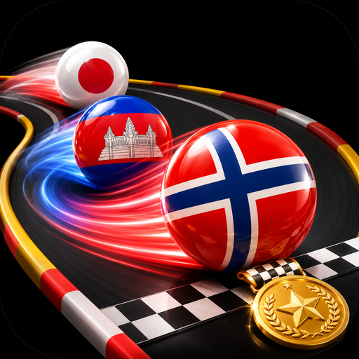
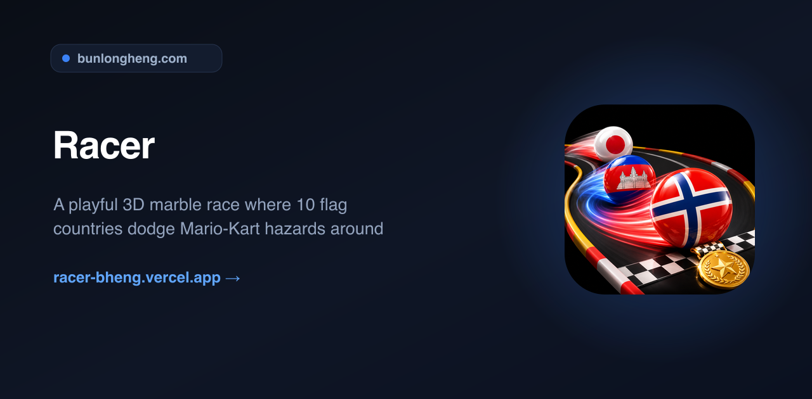
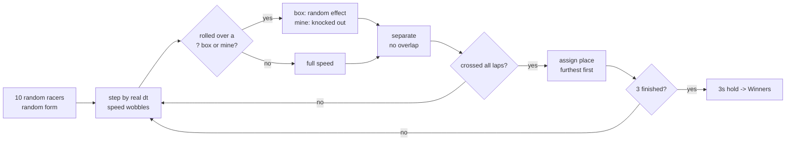

<div align="center">
  
  <h1>Racer</h1>
  <p><em>A playful 3D marble race where 10 flag countries dodge Mario-Kart hazards around</em></p>
  <p><a href="https://racer-bheng.vercel.app">Live</a> &middot; <a href="https://github.com/bunlongheng/racer">Repo</a> &middot; <a href="https://bunlongheng.com/projects?name=racer">Portfolio</a></p>
  
</div>

---

# Racer

> Pick a themed stage, set the laps, and watch 10 random countries race as glossy 3D flag marbles around an oval track - dodging hazards, jockeying the whole way - until a gold, silver, and bronze podium is crowned. A tiny, playful game for kids.

<p>
  
  
  
  
  
</p>

**Live:** https://racer-bheng.vercel.app


---

## What it does

- On the setup screen you pick a **stage**, the number of **laps** (rounds), and whether to show the **live results** board or let it **auto-play** hands-free.
- **10 random countries** line up as **true 3D glossy flag marbles** (WebGL) and race around a themed oval track.
- **8 themed stages** paint the whole map as their scene - Horse Race, Soccer Field, Football Field, Stadium, Airport, River Side, Beach Vibe, Snow Park - and the marble runs on the terrain.
- **8 mystery `?` boxes** sit fixed at the 3 and 9 o'clock sides; open one and it rolls a random effect - boost, mud, tar, banana, shrink, grow, or a big **fire** speed boost - then refills.
- Rare **bomb mines** drop onto the track - roll over one and you are knocked out (unless too few racers remain to spare one).
- A **live top-5 board** (top-left) and **1/2/3 medal badges** over the leaders track the standings in real time.
- After the set laps, the first 3 across the line take the **podium** - gold, silver, bronze - with confetti and a celebration fanfare.
- Each stage has its own **synth music** (starts on GO) and all sound effects are synthesised - **zero audio files**.


---

## How the race works

The race is a small, **pure, unit-tested core** driven by a single `requestAnimationFrame` loop. The 2D canvas draws the themed track + HUD; a transparent React-Three-Fiber layer renders the glossy 3D marbles over it.



Three ideas keep it fun **and** correct:

- **Deterministic overtaking** comes from a two-sine `wobble` per racer, so the pack shuffles the whole way with no real randomness in the physics (`lib/race.ts`).
- **No visible overlap** even on the tight bends: marbles are pushed apart in **real screen space**, then the push is split back into along-track and lateral motion via the local track frame (`lib/geometry.ts`).
- **The clock is real time**, so a lap always takes the same wall-clock span regardless of frame rate.

The engine and the geometry both live behind pure functions with tests (`tests/race.test.ts`, `tests/geometry.test.ts`).

---

## Architecture

| Module | Role |
| --- | --- |
| `app/page.tsx` + `layout.tsx` | Static server shell, metadata, font, PWA registration |
| `app/components/Race.tsx` | Canvas + rAF loop, HUD, and every screen (one client component) |
| `app/components/RaceMarbles.tsx` | React-Three-Fiber 3D marble overlay |
| `lib/race.ts` | Pure, dependency-free, unit-tested race engine |
| `lib/geometry.ts` | Pure oval geometry + real-space anti-overlap solver (tested) |
| `lib/sound.ts` | Web Audio synth - SFX + per-stage music, zero files |
| `app/data/stages.ts` | The 8 themed stages (painters + palettes) |
| `app/data/countries.ts` | 194 countries (code, name, accent hue) |
| `public/flags/` | 194 self-hosted flag PNGs |
| `public/sw.js` | Hand-written service worker for offline play |

Everything is **self-hosted** - the 194 flags, the font (`next/font`), and all audio (synthesised) - so there is no third-party CDN and the Content-Security-Policy stays locked to `'self'`.

## Design decisions and trade-offs

| Decision | Chosen | Alternative | Why | Cost we accept |
| --- | --- | --- | --- | --- |
| Marbles | True 3D (three.js / R3F) | 2D sprites | Genuinely glossy, rolling spheres | A WebGL layer over the canvas |
| Field size | 10 racers per race | All 194 at once | Readable, uncrowded track | Only 10 flags per race |
| Overlap | Real-space solver | Flat (u, lane) solver | Correct on the tight oval bends | ~20 relaxation passes/frame |
| Audio | Synthesised (Web Audio) | Audio files | No licensing, works offline, CSP `'self'` | Chiptune, not produced tracks |
| Flags | Self-hosted PNGs | Remote flag CDN | No third-party dependency | ~800KB committed |
| Offline | Hand-written SW | next-pwa plugin | Plugin breaks on Next 16 / Turbopack | Maintain ~40 lines of SW |

---

## Tech stack

- **Framework:** Next.js 16 (App Router, static prerender)
- **UI runtime:** React 19
- **3D:** three.js + @react-three/fiber + drei (WebGL marbles)
- **Track + HUD:** HTML5 Canvas 2D
- **Language:** TypeScript (strict)
- **Styling:** Tailwind CSS 4
- **Audio:** Web Audio API (synth)
- **Tests:** node:test (unit) + Playwright (e2e)
- **Hosting:** Vercel - PWA, offline-capable

---

## Quick start

```bash
git clone https://github.com/bunlongheng/racer.git
cd racer
npm install
npm run dev            # http://localhost:3030
```

No environment variables are required - it is a fully static, self-contained game.

### Scripts

| Command | What it does |
| --- | --- |
| `npm run dev` | Start the dev server on port 3030 |
| `npm run build` | Production build |
| `npm run typecheck` | `tsc --noEmit` |
| `npm run lint` | ESLint (typescript-eslint + next core-web-vitals) |
| `npm test` | Unit tests: race engine, geometry, and country data |
| `npm run test:e2e` | Playwright end-to-end race |

---

## Project layout

```
app/
  page.tsx                 server shell
  layout.tsx               metadata, font, PWA registration
  components/Race.tsx       canvas race loop + HUD + screens
  components/RaceMarbles.tsx  3D marble overlay (R3F)
  data/stages.ts            8 themed stages
  data/countries.ts         194 countries (code, name, accent hue)
lib/
  race.ts                  pure, tested race engine
  geometry.ts              pure oval math + anti-overlap solver (tested)
  sound.ts                 Web Audio synth (SFX + per-stage music)
public/
  flags/                   194 self-hosted flag PNGs
  sw.js                    offline service worker
tests/                     unit tests (race, geometry, data)
e2e/                       Playwright race test
```

---

## License

MIT - see [LICENSE](LICENSE).

---

<p align="center">
  <sub>Built by <a href="https://bunlongheng.com">Bunlong Heng</a> &middot; <a href="https://bunlongheng.com/projects/racer">See it in my portfolio &rarr;</a></sub>
</p>
